# restic-ui

A web UI + backend for configuring and running [restic](https://restic.net)
backups, built for homelab users (Unraid and similar). Ships as a single Docker
container.

> **Status:** v1 feature-complete, pre-release.

<!-- Screenshots come in dark + light pairs; the <picture> element serves the
     variant matching the viewer's color scheme. Regenerate them with
     `cd e2e && npm run screenshots` + `scripts/compress-screenshots.sh`. -->
<picture>
  <source media="(prefers-color-scheme: dark)" srcset="docs/screenshots/dashboard-dark.webp">
  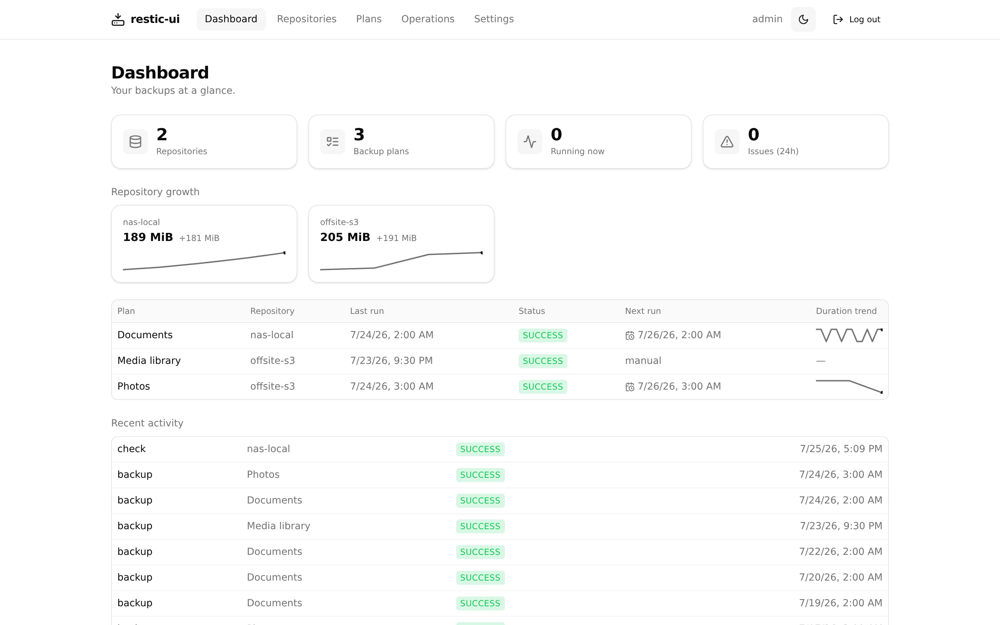
</picture>

## Highlights

- Repositories on a **local path, S3-compatible storage, SFTP, or rclone**
  (rclone unlocks ~70 more providers) — credentials **encrypted at rest**
  (AES-256-GCM).
- Scheduled **backup plans** with an in-UI folder picker, include/exclude
  patterns, tags, bandwidth limits, and per-plan **retention** applied
  automatically after each backup — plus **dry-run previews** for both.
- **Browse, download, and restore** files from any snapshot — no FUSE, no
  special container privileges.
- **Find** files across all snapshots, **diff** any two snapshots, and
  **copy/replicate** to a second repository (3-2-1 backups).
- **Live progress and logs** over WebSocket, in-app toasts, and
  **growth / duration trend charts** from recorded stats history.
- **Scheduled integrity checks** and notifications through an
  [Apprise API](https://github.com/caronc/apprise-api) server (Discord,
  Telegram, ntfy, email, and 80+ more).
- Single-user login with optional **reverse-proxy SSO bypass**
  (Authelia/Authentik), plus dark mode.
- _Planned (phase 2):_ host storage for other restic clients (rest-server),
  pre/post hooks, optional FUSE mount, multi-user.

## Quick start

```sh
docker compose up --build
# open http://localhost:8080
```

Mount the folders you want to back up (read-only is recommended) and a
destination folder for local repositories — see `docker-compose.yml`.
Prebuilt multi-arch images are on Docker Hub as
[`jonnyczi/restic-ui`](https://hub.docker.com/r/jonnyczi/restic-ui).

**Unraid:** a Community Applications template is provided in
`unraid-template.xml`. Until it lands in CA, copy it to
`/boot/config/plugins/dockerMan/templates-user/` on your Unraid box, then
pick *restic-ui* from the template dropdown under Docker → Add Container.

### 1. Create your admin account

First visit sets up the single admin user.

<picture>
  <source media="(prefers-color-scheme: dark)" srcset="docs/screenshots/setup-dark.webp">
  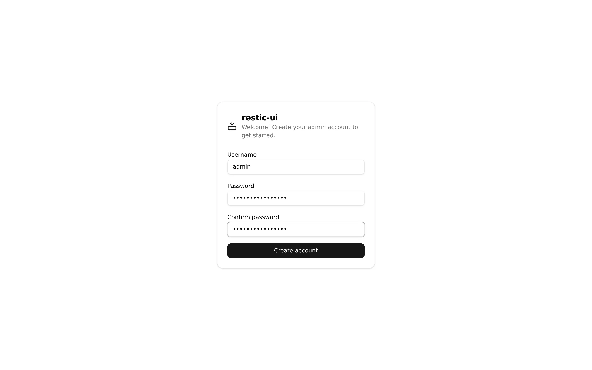
</picture>

### 2. Add a repository

Pick a backend and enter where snapshots should be stored. With *auto-init*
checked, the repository is created and initialized in one step; secrets are
stored encrypted.

<picture>
  <source media="(prefers-color-scheme: dark)" srcset="docs/screenshots/add-repo-dark.webp">
  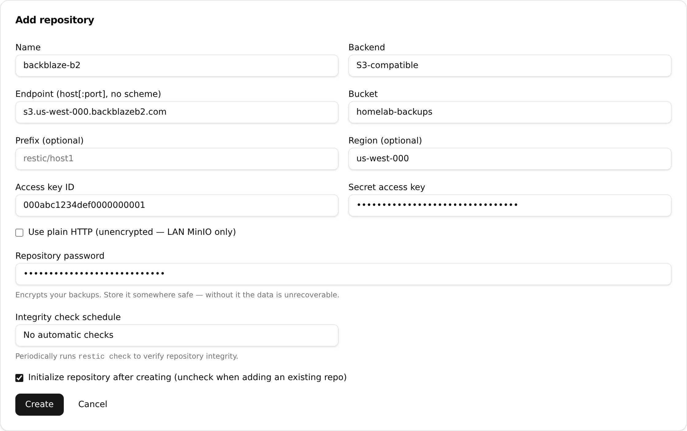
</picture>

### 3. Create a backup plan

Choose source folders with the built-in picker, add excludes and tags, and
pick a schedule (or run manually).

<picture>
  <source media="(prefers-color-scheme: dark)" srcset="docs/screenshots/add-plan-dark.webp">
  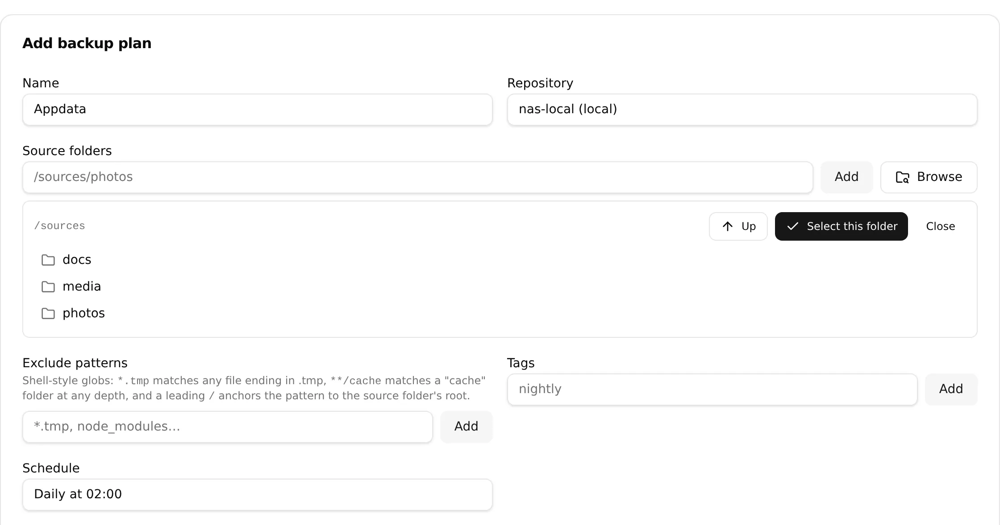
</picture>

### 4. Run it

**Run now** starts a backup immediately — progress streams live into the plan
card — and scheduled plans fire on their cron from then on.

<picture>
  <source media="(prefers-color-scheme: dark)" srcset="docs/screenshots/backup-live-dark.webp">
  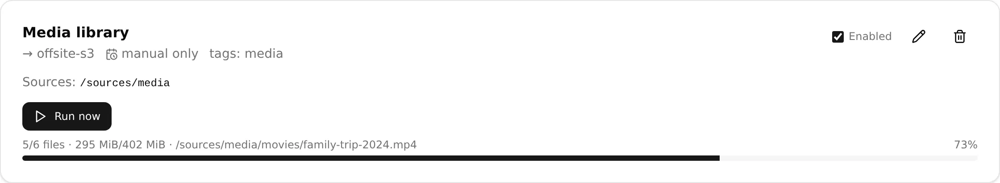
</picture>

## Tour

### Repositories & snapshots

Each repository card offers connection tests, integrity checks (one-off or on
their own cron), lock cleanup, and prune. The snapshots panel shows repo
stats with a size trend, every snapshot, and per-snapshot forget — and from
here you can **copy/replicate all snapshots to another repository** for 3-2-1
setups.

<picture>
  <source media="(prefers-color-scheme: dark)" srcset="docs/screenshots/repos-dark.webp">
  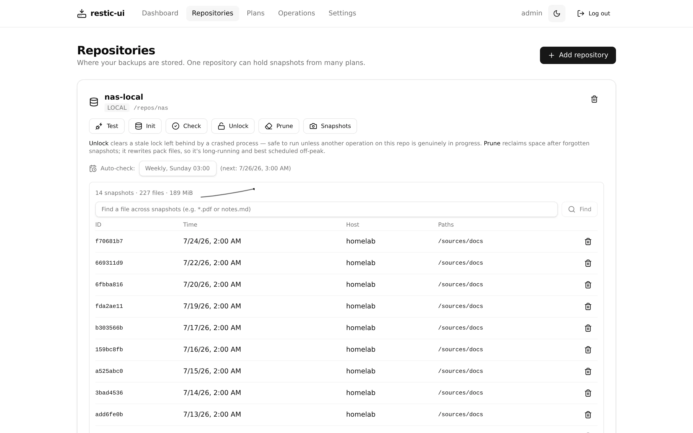
</picture>

### Find a file across snapshots

Glob-search every snapshot at once to figure out where (and when) a file
still exists — each hit links straight into the snapshot browser.

<picture>
  <source media="(prefers-color-scheme: dark)" srcset="docs/screenshots/snapshot-find-dark.webp">
  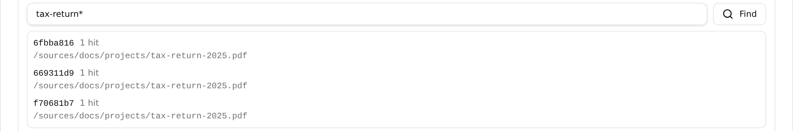
</picture>

### Browse & restore

Walk through a snapshot like a file manager; download single files or restore
files and folders to any target path — implemented with `restic ls`/`dump`/
`restore`, so the container needs no FUSE or special privileges.

<picture>
  <source media="(prefers-color-scheme: dark)" srcset="docs/screenshots/snapshot-browser-dark.webp">
  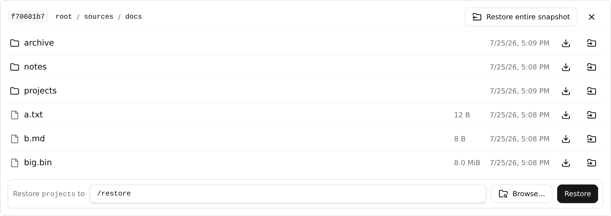
</picture>

### Diff two snapshots

Compare any two snapshots to see what was added, removed, or modified —
handy before restoring or pruning.

<picture>
  <source media="(prefers-color-scheme: dark)" srcset="docs/screenshots/snapshot-diff-dark.webp">
  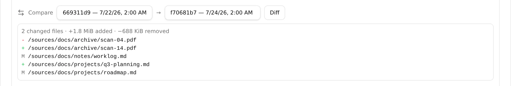
</picture>

### Plans: schedules, options, dry-run

Plan cards show the humanized schedule, next run, sources, and excludes.
Backup options cover bandwidth limits, `--exclude-caches`, and
`--one-file-system` — and **Dry-run this backup** previews exactly what a run
would add before you commit to it.

<picture>
  <source media="(prefers-color-scheme: dark)" srcset="docs/screenshots/plans-dark.webp">
  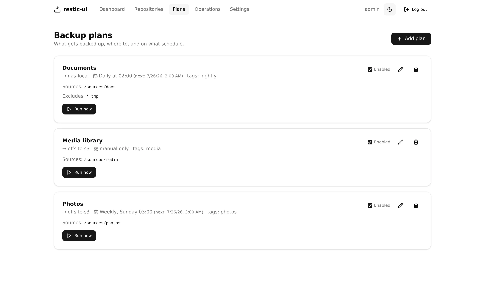
</picture>

<picture>
  <source media="(prefers-color-scheme: dark)" srcset="docs/screenshots/plan-dry-run-dark.webp">
  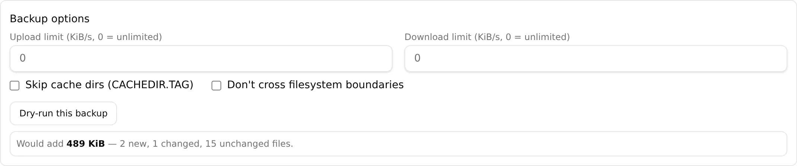
</picture>

### Retention

Per-plan keep-last/daily/weekly/monthly/yearly buckets run `forget` (+
optional `prune`) automatically after each successful backup. **Preview what
this would keep** lists exactly which snapshots a policy would remove.

<picture>
  <source media="(prefers-color-scheme: dark)" srcset="docs/screenshots/plan-retention-dark.webp">
  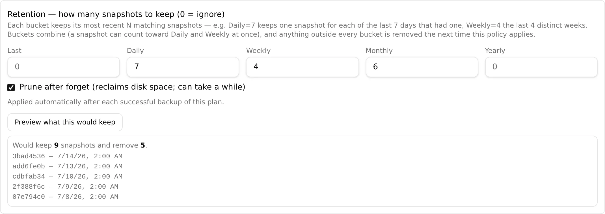
</picture>

### Operations: history & live logs

Every backup, restore, check, prune, and copy lands in a filterable history;
expanding a row shows its log console (streamed live while running). Partial
failures — a file that couldn't be read — surface as a distinct *warning*
status, and finished operations raise toasts on whatever page you're on.

<picture>
  <source media="(prefers-color-scheme: dark)" srcset="docs/screenshots/operations-dark.webp">
  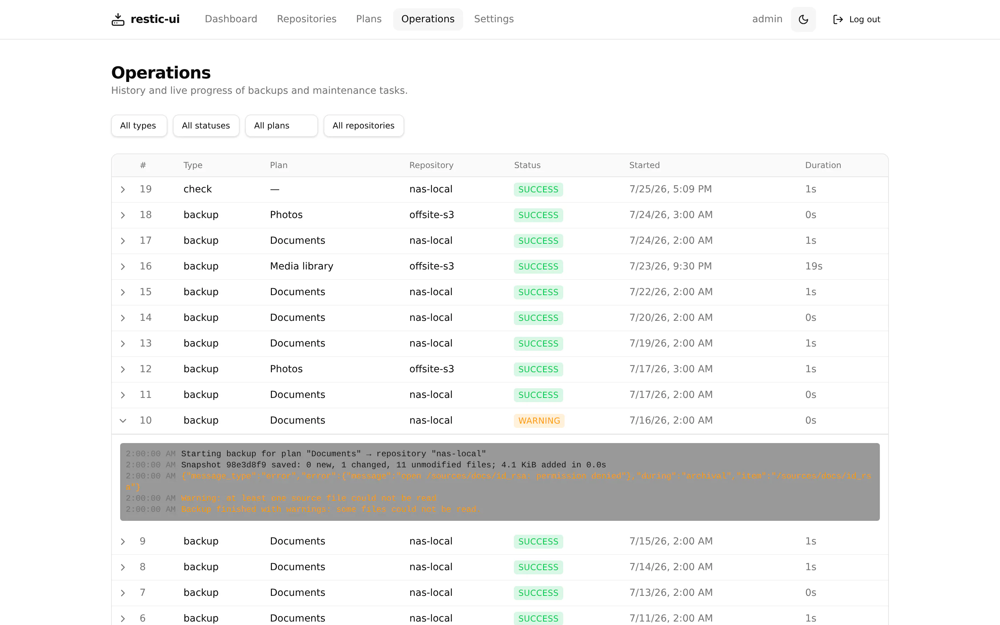
</picture>

### Notifications

Point restic-ui at an [Apprise API](https://github.com/caronc/apprise-api)
server (e.g. the tiny `linuxserver/apprise-api` sidecar) and pick your
services — Discord, Telegram, ntfy, email, and 80+ more.

<picture>
  <source media="(prefers-color-scheme: dark)" srcset="docs/screenshots/settings-dark.webp">
  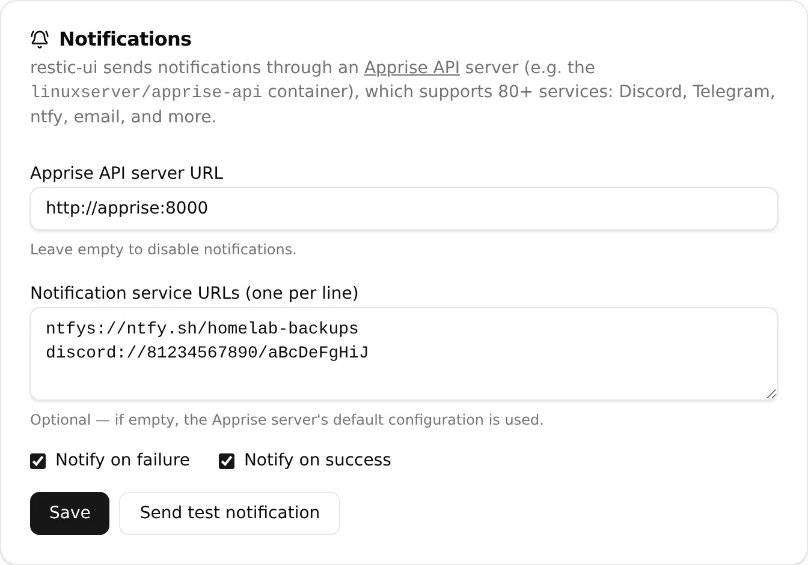
</picture>

## Configuration (environment)

| Variable               | Default    | Description                                            |
| ---------------------- | ---------- | ------------------------------------------------------ |
| `PORT`                 | `8080`     | HTTP listen port.                                      |
| `DATA_DIR`             | `/config`* | SQLite DB + generated master key.                      |
| `RESTIC_CACHE_DIR`     | `DATA_DIR/cache` | restic's repository metadata cache (persists with `/config`). |
| `PUID` / `PGID`        | `1000`     | Runtime user/group (Docker only).                      |
| `RESTIC_UI_KEY`        | —          | Master key for encrypting stored credentials. Supports `RESTIC_UI_KEY_FILE`. Generated + saved under `DATA_DIR` if unset. |
| `AUTH_DISABLED`        | `false`    | Disable built-in login (only behind a trusted proxy).  |
| `TRUSTED_PROXY_HEADER` | —          | Header set by a trusted proxy carrying the user id.    |
| `RESTIC_BINARY`        | `restic`   | Override the restic executable path.                   |
| `RCLONE_BINARY`        | `rclone`   | Override the rclone executable path.                   |

\* Defaults to `./data` when run outside the container.

SFTP host keys are trusted on first use and persisted at
`DATA_DIR/ssh/known_hosts`, so they survive container recreation; a later
host key change is rejected.

## Architecture

- **Backend:** Go — single static binary; drives the bundled `restic` binary by
  shelling out and parsing `--json`; SQLite (pure-Go) for config + history.
- **Frontend:** React + TypeScript + Vite + Tailwind + shadcn/ui, embedded into
  the Go binary.

## Development

Requirements: Go 1.26+, Node 22+, pnpm.

```sh
# Terminal 1 — backend on :8080
make run

# Terminal 2 — frontend dev server (proxies /api to :8080)
make dev
```

Build the fully embedded binary:

```sh
make build      # -> bin/restic-ui  (frontend built + embedded)
```

Build the container:

```sh
make docker            # -> restic-ui:latest (current arch)
make docker-multiarch  # -> linux/amd64 + linux/arm64 (requires buildx)
# or
docker compose up --build
```

## Testing

```sh
make test    # Go unit tests
make e2e     # browser end-to-end suite (Playwright + Docker)
```

The e2e suite (`e2e/`) spins up a disposable environment —
the app, a MinIO server, and a fake Apprise API — via
`e2e/docker-compose.test.yml`, then drives the real UI in Chromium:
first-run setup, auth/session/CSRF, repository management (local + S3),
plans with the folder picker, live WebSocket operations, cron firing,
retention pruning, snapshot browse/download/restore, copy between repos,
and notifications. Set `CHROMIUM_BIN=/path/to/chromium` to use a system
browser instead of Playwright's download.

The README screenshots are generated against the same environment:
`cd e2e && npm run screenshots` stages demo data and captures dark + light
shots, and `scripts/compress-screenshots.sh` writes the committed WebP files
to `docs/screenshots/` (not part of `make e2e`).

CI (GitHub Actions) runs vet/tests, frontend typecheck/build, the e2e
suite, and a multi-arch (amd64 + arm64) image build — pushed to GHCR
and Docker Hub (jonnyczi/restic-ui) on `main` and version tags.
